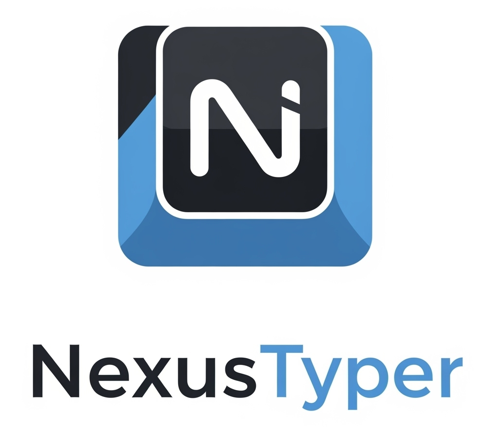

# NexusTyper Pro

A desktop typing automation app that types text into any window with human-like
pacing, configurable mistakes, and macros. Built with PyQt5; runs on macOS,
Windows, and Linux.



## Features

- **Human-like typing** — variable WPM with a Min/Max range, occasional
  adjacency-based mistakes with backspace corrections, natural pauses on
  punctuation.
- **Multiple newline modes** — Line Paste (fastest), Standard Typing, Smart
  Newlines (joins single breaks for prose), List Mode (strips indent for code
  editors).
- **Personas** — quick presets for Deliberate Writer, Fast Messenger, Careful
  Coder, or full manual control.
- **Macros** — embed `{{PAUSE:1.5}}`, `{{PRESS:enter}}`, `{{CLICK:x,y}}`, and
  `{{COMMENT:...}}` directly in your text.
- **Auto-optimize** for the active app (chat, code editor, browser) and
  **Compliance mode** that auto-pauses inside a configurable blocklist.
- **Global hotkeys** for Start / Stop / Resume.
- **Dry-run preview** simulates typing without sending real keystrokes.
- **Diagnostics & logging** at `~/.nexustyper_pro/logs/app.log`.

## Requirements

- Python 3.10+
- macOS, Windows, or Linux
- See [`requirements.txt`](requirements.txt) for Python deps.

### Platform-specific permissions

- **macOS** — System Settings → Privacy & Security → Accessibility (and
  Input Monitoring on macOS 14+) must allow the Python interpreter or the
  packaged `.app`. The app will trigger the prompt on first run.
- **Windows / Linux** — typically no extra setup; on Wayland, install the
  `xdotool` helper for full key-injection support.

## Install & run from source

```bash
git clone https://github.com/<your-fork>/NexusTyper-Pro.git
cd NexusTyper-Pro
python3 -m venv .venv
source .venv/bin/activate          # Windows: .venv\Scripts\activate
pip install -r requirements.txt
python "NexusTyper Pro.py"
```

## Building a standalone app

A PyInstaller spec is included for macOS bundling:

```bash
pip install pyinstaller
pyinstaller "NexusTyper Pro.spec"
# The .app bundle lands in dist/NexusTyper Pro.app
```

For Windows / Linux executables, run PyInstaller against the script directly:

```bash
pyinstaller --windowed --name "NexusTyper Pro" \
    --add-data "ico2.png:." --icon icon.icns "NexusTyper Pro.py"
```

## Distribution & releases

End users grab the latest installable from the **Releases** page on GitHub:
<https://github.com/Tramsnf/NexusTyper-Pro/releases/latest>. Each release
ships an installer **and** a portable archive per platform — pick the one
that fits your situation:

| Platform | Recommended (installer) | Portable fallback |
|---|---|---|
| macOS    | `NexusTyper-Pro-vX.Y-macOS.pkg` — double-click, run through Apple Installer. | `NexusTyper-Pro-vX.Y-macOS.zip` — drag the `.app` to *Applications*. |
| Windows  | `NexusTyper-Pro-vX.Y-Windows-Setup.exe` — Inno Setup wizard. | `NexusTyper-Pro-vX.Y-Windows.zip` — run `NexusTyper Pro.exe` from the extracted folder. |
| Linux    | `nexustyper-pro_X.Y_amd64.deb` — `sudo apt install ./nexustyper-pro_*.deb`. | `NexusTyper-Pro-vX.Y-Linux.tar.gz` — `tar -xzf … && ./NexusTyper-Pro/NexusTyper-Pro`. |

The installers register the app with the OS (Start menu / Launchpad / app
launcher), which means **future launches don't trigger the OS "unverified
developer" warnings** — those only fire on the installer itself, once. The
portable archives are simpler, but the warning will appear every time you
launch from the extracted folder until the binary gets signed.

### First-run notes per platform

#### macOS

Releases are currently **ad-hoc signed but not notarized**. On macOS 15
(Sequoia) and later, Apple removed the right-click → *Open* shortcut for
unverified apps, so the path is:

1. Double-click `NexusTyper-Pro-…macOS.pkg`. macOS will block it with
   *"Apple could not verify…"*.
2. Open **System Settings → Privacy & Security**, scroll down, find the
   blocked-app notice, and click **Open Anyway**.
3. Re-run the .pkg; this time the confirm dialog has an **Open** button.
   Apple Installer takes over and lands the app in `/Applications`.
4. Launch from Launchpad — this works without further prompts because the
   system installer doesn't propagate the download quarantine.

If you used the **portable .zip** instead and macOS says the .app is
"damaged" or refuses to launch, open Terminal in the folder containing the
.app and run:
```bash
xattr -cr "NexusTyper Pro.app"
```
That strips the `com.apple.quarantine` attribute Safari/Chrome attached
when you downloaded.

After first launch, macOS will prompt you to grant **Accessibility** and
**Input Monitoring** in *System Settings → Privacy & Security*. Both are
required for the app to send keystrokes to other windows. If Accessibility
is missing, NexusTyper Pro now blocks a typing run and opens the right
privacy pane instead of silently doing nothing.

#### Windows

The installer (and the portable .exe) is unsigned, so Windows will warn
once. With the installer:

1. Double-click `NexusTyper-Pro-…Setup.exe`. SmartScreen may show
   *"Windows protected your PC"* — click **More info → Run anyway**.
2. Walk through the wizard. Choose per-user install if you don't want a
   UAC prompt.
3. Launch from the Start menu — no further warnings.

If you instead use the portable .zip and Windows shows the **"We can't
verify who created this file"** dialog every time, that's *Mark of the
Web* attached to every extracted file. Right-click the .exe →
**Properties** → tick **Unblock** at the bottom, or run
`Get-ChildItem -Recurse | Unblock-File` in the extracted folder from
PowerShell. The installer path avoids this entirely.

#### Linux

`.deb` installs to `/opt/nexustyper-pro/`, registers a launcher in your app
menu, and pulls Qt/X11 runtime deps from your distro:
```bash
sudo apt install ./nexustyper-pro_*.deb
nexustyper-pro            # also on $PATH
```
The portable tarball just unpacks anywhere and runs in place; useful on
non-Debian distros.

### Code-signing & notarization (optional)

The release workflow automatically signs and notarizes when the
corresponding repository **secrets** are set, and silently falls back to
unsigned builds when they're absent. To enable signing, add these secrets
under **Settings → Secrets and variables → Actions**:

| Secret | Used for |
|---|---|
| `WINDOWS_PFX_BASE64` / `WINDOWS_PFX_PASSWORD` | Authenticode-sign `NexusTyper Pro.exe` and `Setup.exe` |
| `APPLE_APPLICATION_CERT_BASE64` / `APPLE_INSTALLER_CERT_BASE64` / `APPLE_CERT_PASSWORD` | Developer ID signing for the .app and .pkg |
| `APPLE_DEVELOPER_ID_APPLICATION` / `APPLE_DEVELOPER_ID_INSTALLER` | Full identity strings, e.g. `Developer ID Application: Jane Doe (TEAMID)` |
| `NOTARIZE_APPLE_ID` / `NOTARIZE_APPLE_PASSWORD` / `NOTARIZE_TEAM_ID` | `xcrun notarytool` credentials (use an app-specific password) |

### How updates reach users

The app pings GitHub's Releases API at startup (and on demand from
**Help → Check for Updates…**). When a newer `tag_name` than `APP_VERSION`
appears, a non-blocking dialog shows the new version's notes with a
*Download & install* button — that streams the OS-appropriate installer
(`.pkg` / `Setup.exe` / `.deb`) to your Downloads folder with a progress
bar, then hands it to the system installer so you only have to click
through the wizard. The dialog also keeps an *Open download page* fallback
for releases that ship only portable archives. Packaged builds include a
bundled CA certificate store for HTTPS checks, so macOS builds do not depend
on the host Python certificate installer. Background checks fire at most
once a day; the manual menu action bypasses the throttle. Configure or
disable the checker by changing `UPDATE_FEED_URL` near the top of
[`NexusTyper Pro.py`](NexusTyper%20Pro.py) (set to `""` to disable).

### Cutting a release

Bump `APP_VERSION` in `NexusTyper Pro.py`, commit, then push a matching
`v*` tag. The workflow builds macOS/Windows/Linux artifacts in parallel and
attaches them to a GitHub Release with auto-generated notes:

```bash
# Edit APP_VERSION = "X.Y.Z" in the source first, commit, then:
git tag vX.Y.Z
git push origin vX.Y.Z
```

You can also test the build pipeline without cutting a release — push the
**Run workflow** button on the **Release** action page (the workflow listens
for `workflow_dispatch`). Manual runs just publish artifacts on the run
page; no GitHub Release is created.

## Project structure

```
NexusTyper Pro.py        # Single-file PyQt5 app (entry point)
NexusTyper Pro.spec      # PyInstaller bundle config
icon.icns / ico*.png     # App icons
icon.iconset/            # Source PNGs for rebuilding icon.icns
requirements.txt         # Python dependencies
.github/workflows/       # CI / release automation
```

## License

See [`LICENSE`](LICENSE).
